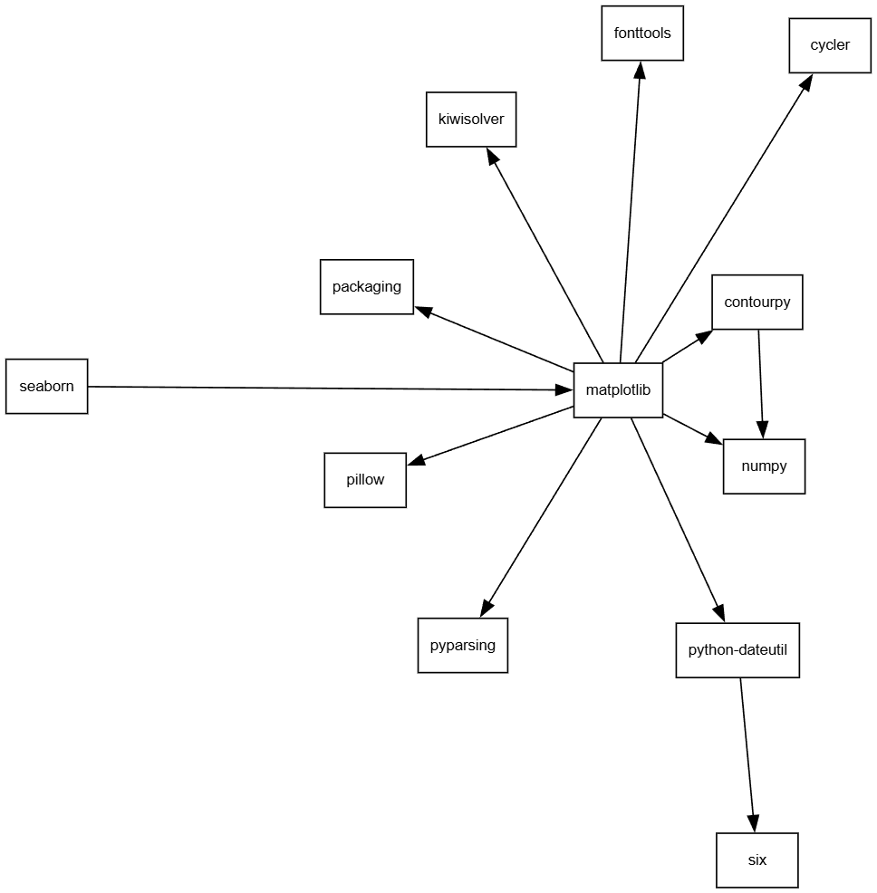
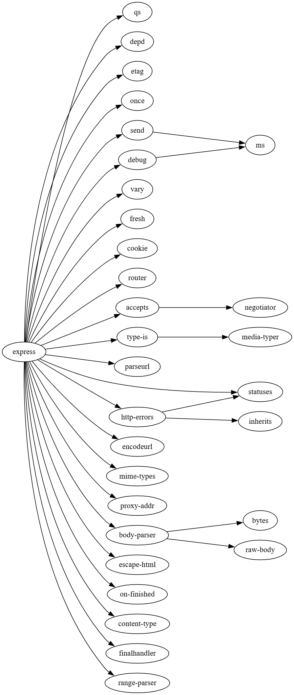

Задания 1-2 решались через cmd

# Задание №1

```
pip --version
```
**Вывод:**

```
pip 26.0.1 from C:\Users\User\AppData\Local\Programs\Python\Python313\Lib\site-packages\pip (python 3.13)
```

Установка пакета 

```
pip install matplotlib
pip show matplotlib
```
**Вывод:**

```
Name: matplotlib
Version: 3.10.8
Summary: Python plotting package
Home-page: https://matplotlib.org
Author: John D. Hunter, Michael Droettboom
Author-email: Unknown <matplotlib-users@python.org>
License: License agreement for matplotlib versions 1.3.0 and later
Requires: contourpy, cycler, fonttools, kiwisolver, numpy, packaging, pillow, pyparsing, python-dateutil
Required-by: seaborn
```

Теперь попытаемся сделать тоже самое, но без менеджера пакетов Python pip

```
git clone https://github.com/matplotlib/matplotlib.git
cd matplotlib
python -m pip install . --no-deps
```
**Вывод:**

```
Processing .\.
  Installing build dependencies ... done
  Getting requirements to build wheel ... done
  Installing backend dependencies ... done
  Preparing metadata (pyproject.toml) ... error
  error: subprocess-exited-with-error

  × Preparing metadata (pyproject.toml) did not run successfully.
  │ exit code: 1
  ╰─> [608 lines of output]
      + meson setup C:\Users\User\matplotlib C:\Users\User\matplotlib\.mesonpy-hvhw0jv4 -Dbuildtype=release -Db_ndebug=if-release -Db_vscrt=md --native-file=C:\Users\User\matplotlib\.mesonpy-hvhw0jv4\meson-python-native-file.ini
      The Meson build system
      Version: 1.12.1
      Source dir: C:\Users\User\matplotlib
      Build dir: C:\Users\User\matplotlib\.mesonpy-hvhw0jv4
      Build type: native build
      Program python found: YES 3.13.5 3.13.5
      Project name: matplotlib
      Project version: 3.12.0.dev679+g3a143fc38
      C compiler for the host machine: gcc (gcc 11.2.0 "gcc (x86_64-posix-seh-rev3, Built by MinGW-W64 project) 11.2.0")
      C linker for the host machine: gcc ld.bfd 2.37
      C++ compiler for the host machine: c++ (gcc 11.2.0 "c++ (x86_64-posix-seh-rev3, Built by MinGW-W64 project) 11.2.0")
      C++ linker for the host machine: c++ ld.bfd 2.37
```
# Задание №2

```
docker pull node:24-slim
docker run -it --rm --entrypoint sh node:24-slim
npm -v
npm view express
 ```

 **Вывод:**

 ```
 
express@5.2.1 | MIT | deps: 28 | versions: 289
Fast, unopinionated, minimalist web framework
https://expressjs.com/

keywords: express, framework, sinatra, web, http, rest, restful, router, app, api

dist
.tarball: https://registry.npmjs.org/express/-/express-5.2.1.tgz
.shasum: 8f21d15b6d327f92b4794ecf8cb08a72f956ac04
.integrity: sha512-hIS4idWWai69NezIdRt2xFVofaF4j+6INOpJlVOLDO8zXGpUVEVzIYk12UUi2JzjEzWL3IOAxcTubgz9Po0yXw==
.unpackedSize: 75.4 kB

dependencies:
qs: ^6.14.0, depd: ^2.0.0, etag: ^1.8.1, once: ^1.4.0, send: ^1.1.0, vary: ^1.1.2, debug: ^4.4.0, fresh: ^2.0.0, cookie: ^0.7.1, router: ^2.2.0, accepts: ^2.0.0, type-is: ^2.0.1, parseurl: ^1.3.3, statuses: ^2.0.1, encodeurl: ^2.0.0, mime-types: ^3.0.0, proxy-addr: ^2.0.7, body-parser: ^2.2.1, escape-html: ^1.0.3, http-errors: ^2.0.0, on-finished: ^2.4.1, content-type: ^1.0.5, finalhandler: ^2.1.0, range-parser: ^1.2.1
(...and 4 more.)

maintainers:
- wesleytodd <wes@wesleytodd.com>
- jonchurch <npm@jonchurch.com>
- ctcpip <c@labsector.com>
- ulisesgascon <ulisesgascondev@gmail.com>
- sheplu <jean.burellier@gmail.com>

dist-tags:
latest: 5.2.1
latest-4: 4.22.3

published 10 months ago by jonchurch <npm@jonchurch.com>
 ```

 # Задание №3

В файле .dog :
```
digraph MatplotlibDependencies {
    layout=circo;
    node [shape=box, fontname="Helvetica", fontsize=10];

    // Обратная зависимость
    "seaborn" -> "matplotlib";

    // Прямые зависимости matplotlib
    "matplotlib" -> "contourpy";
    "matplotlib" -> "cycler";
    "matplotlib" -> "fonttools";
    "matplotlib" -> "kiwisolver";
    "matplotlib" -> "numpy";
    "matplotlib" -> "packaging";
    "matplotlib" -> "pillow";
    "matplotlib" -> "pyparsing";
    "matplotlib" -> "python-dateutil";

    // зависимости второго уровня
    "python-dateutil" -> "six";
    "contourpy" -> "numpy";
}
```

```
digraph ExpressDependencies {
    rankdir=LR;
    
    nodesep=0.25;  
    ranksep=1.5;   
    splines=true;  
    overlap=false; 

    // Прямые зависимости
    "express" -> "qs";
    "express" -> "depd";
    "express" -> "etag";
    "express" -> "once";
    "express" -> "send";
    "express" -> "vary";
    "express" -> "debug";
    "express" -> "fresh";
    "express" -> "cookie";
    "express" -> "router";
    "express" -> "accepts";
    "express" -> "type-is";
    "express" -> "parseurl";
    "express" -> "statuses";
    "express" -> "encodeurl";
    "express" -> "mime-types";
    "express" -> "proxy-addr";
    "express" -> "body-parser";
    "express" -> "escape-html";
    "express" -> "http-errors";
    "express" -> "on-finished";
    "express" -> "content-type";
    "express" -> "finalhandler";
    "express" -> "range-parser";

    // Зависимости второго уровня
    "body-parser" -> "bytes";
    "body-parser" -> "raw-body";
    "send" -> "ms";
    "http-errors" -> "inherits";
    "http-errors" -> "statuses";
    "debug" -> "ms";
    "accepts" -> "negotiator";
    "type-is" -> "media-typer";
}
```
Получаются такие графы: 




# Задание №4

```
% Use this editor as a MiniZinc scratch book
include "alldifferent.mzn";

var 0..9: d1;
var 0..9: d2;
var 0..9: d3;
var 0..9: d4;
var 0..9: d5;
var 0..9: d6;

var int: sum3 = d1 + d2 + d3;

constraint d1 + d2 + d3 == d4 + d5 + d6;
constraint alldifferent([d1, d2, d3, d4, d5, d6]);

solve minimize sum3;
```

**Вывод:**

```
d1 = 8;
d2 = 1;
d3 = 0;
d4 = 4;
d5 = 3;
d6 = 2;
_objective = 9;
----------
d1 = 6;
d2 = 2;
d3 = 0;
d4 = 4;
d5 = 3;
d6 = 1;
_objective = 8;
----------
==========
Finished in 765msec.
```

# Задание №5

```
% menu: 1=1.0.0, 2=1.1.0, 3=1.2.0, 4=1.3.0, 5=1.4.0, 6=1.5.0
% dropdown: 1=1.8.0, 2=2.0.0, 3=2.1.0, 4=2.2.0, 5=2.3.0
% icons: 1=1.0.0, 2=2.0.0

var 1..6: menu_ver;
var 1..5: dropdown_ver;
var 1..2: icons_ver;

constraint icons_ver = 1;

constraint menu_ver = 6 -> dropdown_ver = 5;
constraint menu_ver = 5 -> dropdown_ver = 4;
constraint menu_ver = 4 -> dropdown_ver = 3;
constraint menu_ver = 3 -> dropdown_ver = 2;
constraint menu_ver = 2 -> dropdown_ver = 1;

constraint dropdown_ver >= 2 -> icons_ver = 2;

solve satisfy;

```

**Вывод:**
```
Running Task5.mzn
782msec

menu_ver = 1;
dropdown_ver = 1;
icons_ver = 1;
----------
Finished in 782msec.
```

Расшифровка: menu_ver = 1 -> menu_ver = 1.0.0; dropdown_ver = 1 -> 1.8.0; icons_ver = 1 -> icons_ver = 1.0.0

# Задание №6

```
% root: 1.0.0 = 1;
% foo: 1.0.0 = 1;
% foo: 1.1.0 = 2;
% left: 1.0.0 = 1;
% right: 1.0.0 = 1;
% shared: 1.0.0 = 1;
% shared: 2.0.0 = 2;
% target 1.0.0 = 1;
% target 2.0.0 = 2;

int: root = 1;     
var 1..2: foo;      
var 0..1: left;    
var 0..1: right;    
var 0..2: shared;   
var 1..2: target;   
 
constraint foo in 1..2;
constraint target = 2;
 
 constraint foo = 2 -> left = 1;
 constraint foo = 2 -> right = 1;
 
 constraint left = 1 -> shared >= 1;
 constraint right = 1 -> shared < 2;
 
 constraint shared = 1 -> target = 1;
 ```

 **Вывод:**
 ```
Running task6.mzn
422msec

foo = 1;
left = 0;
right = 0;
shared = 0;
target = 2;
----------
Finished in 422msec.
```

# Задание №7

```
int: num_packages;
int: max_versions;

array[1..num_packages] of var 0..max_versions: selected_version;

array[1..num_packages, 1..max_versions, 1..num_packages] of int: dependencies;

constraint forall(p in 1..num_packages, v in 1..max_versions)(
    (selected_version[p] == v) -> 
        forall(req in 1..num_packages)(
            selected_version[req] >= dependencies[p, v, req]
        )
);
```